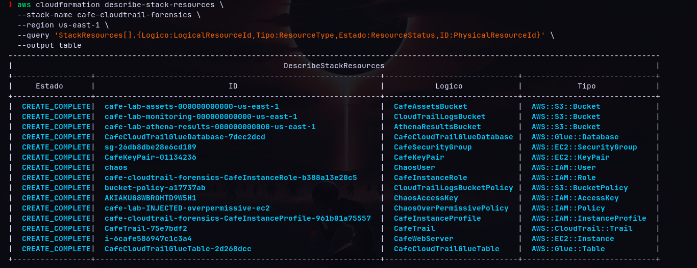
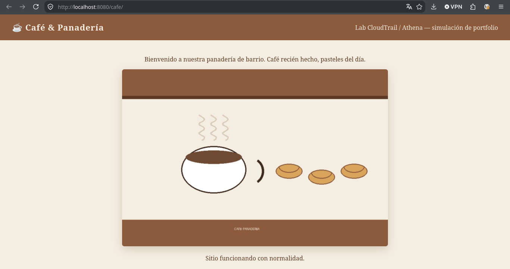
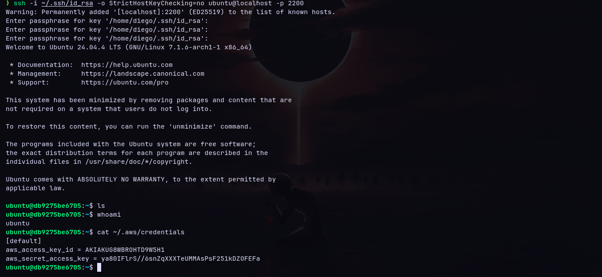
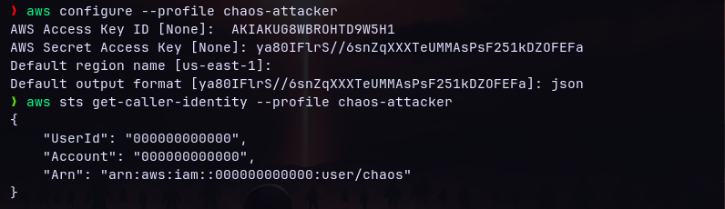
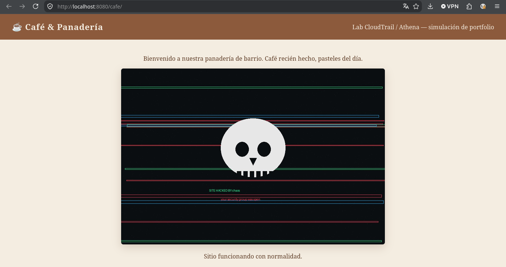
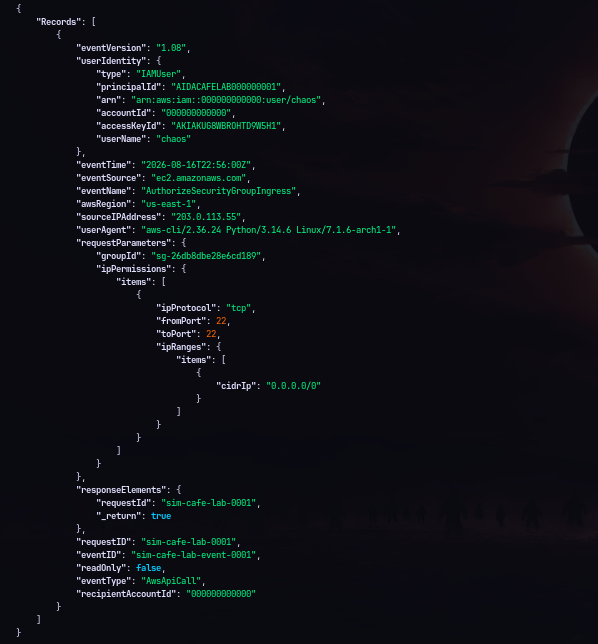

# ☕ Café CloudTrail Forensics

End-to-end simulation of an AWS security incident: compromise, forensic investigation with CloudTrail/Athena, and remediation — over real infrastructure deployed with CloudFormation.


## Motivation

Plaintext credentials left on a compromised host are one of the most common causes of privilege escalation in real AWS incidents. This project simulates that full scenario — from the injected vulnerability to verified remediation — to practice the detection and forensic investigation workflow expected in a cloud security role (SOC / Cloud Support), not just the theory behind it.

## What it simulates

A fictional coffee shop's web server is exposed through an overly permissive Security Group. Plaintext AWS credentials are left on the host (a real-world bad practice from an admin who never rotated them). An attacker gets in via SSH, finds the credentials, escalates with them, and defaces the site. The investigation reconstructs the attack through CloudTrail, and the incident closes with full remediation.

| Phase | Action |
|---|---|
| 1. Exposure | Security Group opens SSH to `0.0.0.0/0` |
| 2. Initial access | Attacker connects via SSH, finds `~/.aws/credentials` in plaintext |
| 3. Escalation | Uses the leaked credentials (over-permissive `ec2:*` policy) from an external profile |
| 4. Impact | Site defacement |
| 5. Investigation | Event reconstruction via CloudTrail |
| 6. Remediation | Security Group closed, access key revoked, site restored |

## Screenshots

**Site running normally, before the incident:**



**Infrastructure deployed by CloudFormation — all resources `CREATE_COMPLETE`:**



**Initial SSH access and discovery of plaintext credentials:**



**Leaked credentials used from an external AWS profile (`chaos-attacker`):**



**Impact — defaced site:**



**Forensic evidence — reconstructed CloudTrail event, showing the `AuthorizeSecurityGroupIngress` call from user `chaos`:**



## Infrastructure (CloudFormation)

The template deploys:

- **EC2** — web server (Apache) with a Security Group initially restricted to HTTP.
- **IAM** — user `chaos` with an over-permissive policy (`ec2:*` on `*`) injected on purpose: that policy **is** the lab's vulnerability.
- **S3** — site assets bucket + CloudTrail logs bucket + Athena results bucket.
- **CloudTrail** — active trail on the account.
- **Glue/Athena** — database and table with partition projection over the CloudTrail logs, to query the incident via SQL without needing a crawler.

The full vulnerability chain: `chaos`'s credentials are left in plaintext on the EC2 instance itself → whoever gets in via SSH finds them → escalates from there to whatever scope the over-permissive policy allows.

## Two ways to run it

- **Real AWS:** the template runs unmodified — `infra/cloudformation/cafe-lab-stack.yaml`.
- **Floci (local emulator, no cost):** adapted version at `infra/cloudformation/cafe-lab-stack-floci.yaml`, with 3 compatibility adjustments (AMI, instance type, key pair import) and a full reproducible guide at `docs/floci-session/GUIA-floci-cafe-lab.md`.

The run against Floci was documented end-to-end in `docs/floci-session/bitacora-cafe-floci.md`, including **12 emulator gaps** found along with their workarounds (CloudTrail not delivering logs, Athena not syncing with Glue, container IPs changing on restart, among others). The real template is left untouched — the workarounds only apply to the local version.

## Forensic investigation

The key event (`AuthorizeSecurityGroupIngress` on the Security Group, executed by `chaos`) is reconstructed with an Athena query over the CloudTrail table:

```sql
SELECT eventtime, eventname, useridentity.username, sourceipaddress
FROM cafe_cloudtrail_forensics.cloudtrail_logs_monitoring
WHERE eventname = 'AuthorizeSecurityGroupIngress'
  AND useridentity.username = 'chaos';
```

## Remediation

```bash
# 1. Revoke the open SSH rule
aws ec2 revoke-security-group-ingress \
  --group-id <SecurityGroupId> --protocol tcp --port 22 --cidr 0.0.0.0/0

# 2. Deactivate and delete the compromised access key
aws iam update-access-key --user-name chaos --access-key-id <ChaosAccessKeyId> --status Inactive
aws iam delete-access-key --user-name chaos --access-key-id <ChaosAccessKeyId>

# 3. Restore the site and clean up credentials on the host
```

## License

MIT — see [LICENSE](LICENSE).
